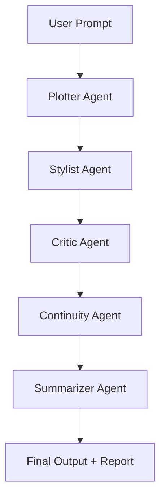

# ✍️ StorySmith: A Multi-Agent AI System for Writers  
**A modular, intelligent assistant that helps creative writers brainstorm, draft, critique, and refine their work—powered by LLMs, RAG, and multi-agent orchestration.**  
Built by [Aayush Kumar](https://www.linkedin.com/in/aayushakumars/)

---

## 📌 Overview

**StorySmith** is a multi-agent AI system designed to assist writers at every stage of the writing process. It uses LLM agents with specialized roles (Plotter, Stylist, Critic, Continuity Checker, Summarizer) to help users ideate, draft, edit, and polish fiction or nonfiction content. The system is built using **LangGraph** for multi-agent coordination, **LangChain** for tool integration, **FAISS** for retrieval, and **Mistral 7B** or **GPT-4** as the LLM backbone.

🎯 **Use Case**: Writers, authors, scriptwriters, students, and content creators  
💼 **Goal**: Showcase cutting-edge LLM system design, multi-agent architecture, RAG optimization, and user-friendly AI workflows for writing

---

## 🧠 Key Features

| Feature | Description |
|--------|-------------|
| 🧩 Modular Multi-Agent Workflow | Plot, critique, edit, and enhance with purpose-built LLM agents |
| 🔍 Retrieval-Augmented Generation (RAG) | Personal story memory or writing guides injected into agent prompts |
| 🧠 LangGraph Workflow | Event-driven multi-agent graph with memory, retries, and state control |
| ✨ Agent Specialization | Each agent is prompt-engineered and tool-augmented for a specific writing task |
| 🖼️ Web UI (Gradio / Streamlit) | Friendly interface to co-write or submit stories for feedback |
| 📝 PDF Report Export | Get a professional “editor-style” critique report as output |

---

## 🛠️ Tech Stack

- **LangGraph**: Multi-agent orchestration
- **LangChain**: Agent tools, prompt routing, memory
- **Mistral-7B-Instruct / GPT-4**: Backbone LLM
- **FAISS + SentenceTransformers**: RAG retriever (story memory, style examples)
- **Gradio / Streamlit**: Interactive frontend
- **Tiktoken**: Token-efficient chunking and summarization
- **Docker**: Deployment and reproducibility
- **OpenAI / Ollama / Groq**: Backend LLM serving

---

## 🔁 Agent Architecture

### 🧱 Core Agents

1. **Plotter Agent**
   - Takes a prompt or idea and builds a story arc (e.g., 3-act structure, hero’s journey)
   - Tool: Outline Generator

2. **Stylist Agent**
   - Matches or transforms text to a specific literary voice (Hemingway, Orwell, Tolkien)
   - Tool: Style Reference Retriever (FAISS)

3. **Critic Agent**
   - Evaluates your writing for clichés, weak sentences, or tonal inconsistencies
   - Tool: Line-by-line critique + Rubric scoring

4. **Continuity Agent**
   - Tracks characters, settings, and timelines for consistency
   - Memory: Stores global state to detect mismatches

5. **Summarizer Agent**
   - Generates short synopses, back cover blurbs, and chapter summaries
   - Tool: Token-aware summarization via Tiktoken

---

## 🧬 Workflow Diagram



---

## 🔍 RAG Components

- **Writer Memory Index**: Personalized writing samples and prior story excerpts
- **Reference Styles Index**: Examples from famous authors (used by Stylist Agent)
- Chunked and embedded with `all-mpnet-base-v2`, stored in FAISS

---

## 📋 Sample Use Case

> **Prompt**: “A sci-fi short story about a hacker who discovers emotions in a machine.”

- **Plotter Agent** outlines the arc: setup, confrontation, resolution
- **Stylist Agent** adapts the tone to Isaac Asimov’s style
- **Critic Agent** highlights weak conflict, recommends richer metaphors
- **Continuity Agent** catches timeline inconsistency (scene happens before it should)
- **Summarizer Agent** gives a back-cover summary + logline

---

## ✨ Output

- Final story draft (HTML/text download)
- PDF critique report with:
  - Line edits
  - Structural feedback
  - Style analysis
  - Suggested revisions
- Optional: Markdown outline and plot structure export

---

## 🚀 Roadmap

| Milestone | Status |
|----------|--------|
| ✅ Agent Prototypes (LLM-only) |  In progress |
| ✅ LangGraph orchestration |  In progress |
| 🔄 Add FAISS + retrieval memory | Not started |
| 📋 Story memory + style index | Not started |
| 🖼️ Build Gradio UI | Not started |
| 📤 Export to PDF/Markdown | Not started |
| 📢 Publish blog/demo video | Not started |

---

## 📁 Repository Structure

```
storysmith/
│
├── agents/
│   ├── plotter_agent.py
│   ├── stylist_agent.py
│   ├── critic_agent.py
│   ├── continuity_agent.py
│   └── summarizer_agent.py
│
├── retriever/
│   ├── embed_writer_memory.py
│   └── faiss_index.py
│
├── app/
│   ├── ui.py
│   └── export_tools.py
│
├── langgraph_flow.py
├── prompts/
├── requirements.txt
└── README.md
```

---
<!---
## 💼 Resume-Ready Takeaways

**Tech/Skills to Highlight:**
- LangGraph orchestration
- Retrieval-Augmented Generation (RAG)
- Prompt engineering & tool use in LLMs
- Token-efficient design (Tiktoken)
- FAISS, SentenceTransformers, custom retrievers
- Dockerized LLM app deployment
- Storytelling + creativity + engineering

---
--> 

## 📣 Want to Try It? (In progress)

> Clone this repo, install dependencies, and run:
```bash
python app/ui.py
```
<!---
Or try the hosted demo: [🔗 Streamlit App (Coming Soon)](https://your-demo-link.com)
--> 
---

<!---
your comment goes here
and here
## 🧠 Learn More

[comment]:  - [How I Designed a Multi-Agent System for Writers](#) (Blog Post)
[comment]: - [LangGraph: Event-Based Agent Workflows](https://docs.langchain.com/langgraph/)
- [Prompt Engineering for Literary Tasks](#) (Coming Soon)
- [FAISS for Narrative Memory: A Deep Dive](#)

---
--> 
## 🧑‍💻 Author

**Aayush Kumar**  
Machine Learning Engineer | LLM Systems | RAG Architect  
📬 [akuma102@uic.edu](mailto:akuma102@uic.edu)  
🔗 [LinkedIn](https://www.linkedin.com/in/aayushakumars/)  
📂 [GitHub](https://github.com/aayushakumar)

---
